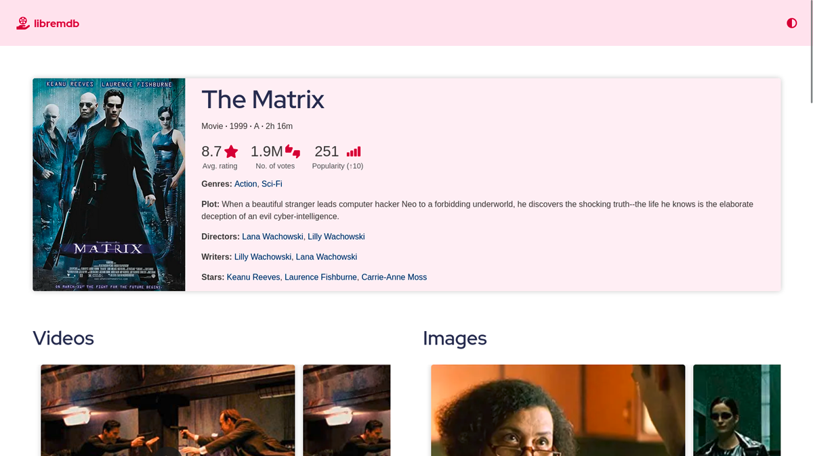

<!--
N.B.: This README was automatically generated by https://github.com/YunoHost/apps/tree/master/tools/README-generator
It shall NOT be edited by hand.
-->

# Libremdb pour YunoHost

[](https://dash.yunohost.org/appci/app/libremdb)  

[](https://install-app.yunohost.org/?app=libremdb)

*[Read this readme in english.](./README.md)*

> *Ce package vous permet d’installer Libremdb rapidement et simplement sur un serveur YunoHost.
Si vous n’avez pas YunoHost, regardez [ici](https://yunohost.org/#/install) pour savoir comment l’installer et en profiter.*

## Vue d’ensemble

A free & open source IMDb front-end.

### Features

- Browse any movie info without being tracked or bombarded by annoying ads.
- Modern interface with curated colors supporting both dark and light themes.
- Be it your small mobile or big computer screen, it’s fully responsive.
- Lightweight


**Version incluse :** 3.1.1~ynh1

**Démo :** https://libremdb.iket.me/about

## Captures d’écran



## Documentations et ressources

* Site officiel de l’app : <https://libremdb.iket.me/>
* Dépôt de code officiel de l’app : <https://github.com/zyachel/libremdb>
* Signaler un bug : <https://github.com/YunoHost-Apps/libremdb_ynh/issues>

## Informations pour les développeurs

Merci de faire vos pull request sur la [branche testing](https://github.com/YunoHost-Apps/libremdb_ynh/tree/testing).

Pour essayer la branche testing, procédez comme suit.

``` bash
sudo yunohost app install https://github.com/YunoHost-Apps/libremdb_ynh/tree/testing --debug
ou
sudo yunohost app upgrade libremdb -u https://github.com/YunoHost-Apps/libremdb_ynh/tree/testing --debug
```

**Plus d’infos sur le packaging d’applications :** <https://yunohost.org/packaging_apps>