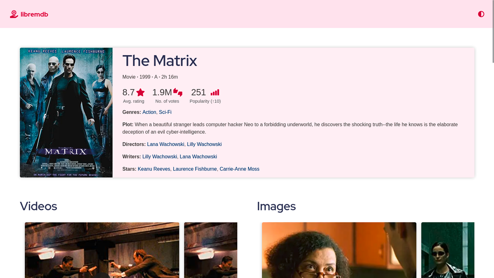

<!--
NOTA: Este README foi creado automáticamente por <https://github.com/YunoHost/apps/tree/master/tools/readme_generator>
NON debe editarse manualmente.
-->

# Libremdb para YunoHost

[](https://ci-apps.yunohost.org/ci/apps/libremdb/)  

[](https://install-app.yunohost.org/?app=libremdb)

*[Le este README en outros idiomas.](./ALL_README.md)*

> *Este paquete permíteche instalar Libremdb de xeito rápido e doado nun servidor YunoHost.*  
> *Se non usas YunoHost, le a [documentación](https://yunohost.org/install) para saber como instalalo.*

## Vista xeral

A free & open source IMDb front-end.

### Features

- Browse any movie info without being tracked or bombarded by annoying ads.
- Modern interface with curated colors supporting both dark and light themes.
- Be it your small mobile or big computer screen, it’s fully responsive.
- Lightweight


**Versión proporcionada:** 3.4.0~ynh1

**Demo:** <https://libremdb.iket.me/about>

## Capturas de pantalla



## Documentación e recursos

- Web oficial da app: <https://libremdb.iket.me/>
- Repositorio de orixe do código: <https://github.com/zyachel/libremdb>
- Tenda YunoHost: <https://apps.yunohost.org/app/libremdb>
- Informar dun problema: <https://github.com/YunoHost-Apps/libremdb_ynh/issues>

## Info de desenvolvemento

Envía a túa colaboración á [rama `testing`](https://github.com/YunoHost-Apps/libremdb_ynh/tree/testing).

Para probar a rama `testing`, procede deste xeito:

```bash
sudo yunohost app install https://github.com/YunoHost-Apps/libremdb_ynh/tree/testing --debug
ou
sudo yunohost app upgrade libremdb -u https://github.com/YunoHost-Apps/libremdb_ynh/tree/testing --debug
```

**Máis info sobre o empaquetado da app:** <https://yunohost.org/packaging_apps>
